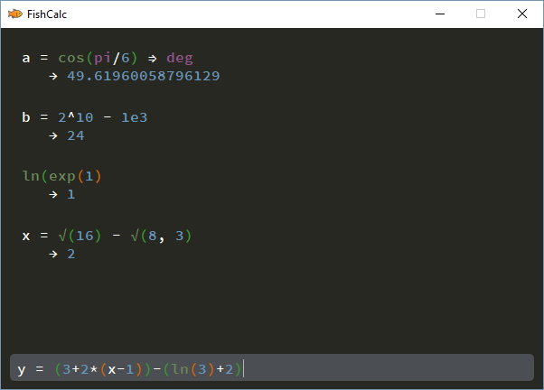

# FishCalc

This small calculator (<1MB) comes with a custom interpreter that :
- highlight functions, keywords, constants and parenthesis while typing
- allow to use variables
- loaded scripts
- handle conversions (for now, ```rad``` and ```deg```)
- handle logic tests
- give the user helpful error messages

The scanner and parser are fully elaborated on the  online book [Crafting Interpreters](https://craftinginterpreters.com/) by [Bob Nystrom](https://github.com/munificent), but made easier (classes and scopes are not really required for a calculator)

The UI is built with PyQt5.




# Requirements

```PyQt5 >= 5.13.0```

# Usage

Simply type in an expression for it to evaluate. You can also :
- ```load``` a script in any text format. Newline ends the statements.
- mute the result of an expression with ```;```
- use the built in constants (```c```, ```kb```, ```h```, ```pi```...)
- use the built in functions (```cos```, ```log```, ```sqrt```...)
- use ```ans``` which is the last calculation result
- represent numbers as ```1e-3``` or ```10^3```
- convert an angle to degrees or radians : ```cos(pi) -> deg```
 
# TODO
- more conversion options (physical units...)
- ```save``` history and improve loaded scripts usage
